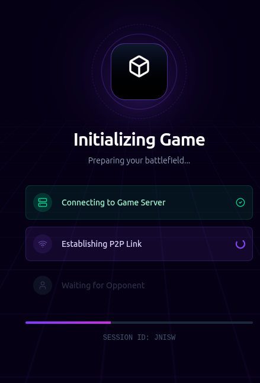
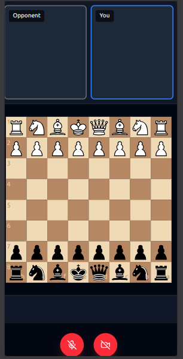

# ChessMate

A real-time multitime chess game integrated with video calling using WebRTC

## Features

- Real-time communication
- get real-time video of opponent


## Tech Stack

**Client:** React, Bun, TailwindCSS

**Server:** Bun, websocket, webRTC

**Infra**: EC2, Github actions, Docker


## Run Locally
### frontend
* Clone the project

```bash
  git clone https://link-to-project
```

* Go to the project directory

```bash
  cd my-project
```
* go to Front-end
```
  cd frontend
```
* Install dependencies

```bash
  bun install
```

* Start the server

```bash
npm run dev
```

### Backend 
#### Option 1: start Locally 
* Go to the project directory

```bash
  cd my-project
```
* go to Front-end
```
  cd backend
```
* Install dependencies

```bash
  bun install
```

* Start the server

```bash
  bun run ./src/index.ts
```

#### Option 2: using docker
``` bash
sudo docker run -p 8080:8080 ranjitdas2048/wc
```
## Screenshots

